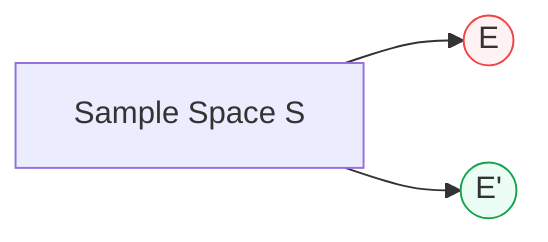

## Start with a story — think of a classroom

Imagine your class has 30 students.
You ask: **“Who is wearing glasses?”** — that’s an **event**.

* `E` = the students wearing glasses.
* The **complement** `E′` = the students **not wearing glasses**.

Together, `E` and `E′` are everyone in the class — there’s no one left out.

That’s the whole idea: **the complement is just “everything else”**.

---

## Big idea in one sentence (no math yet)

If `E` is something you want (like “it rains”), then the complement `E′` is *everything that is not that thing* (like “it does not rain”).

So if the chance of rain is 30%, the chance it **doesn't** rain is 70%.

---

## Why this makes sense — using numbers (easy steps)

1. Probabilities add up to 100% (or `1` in probability language).

   * Example: either it rains or it doesn't — one of those must happen.
2. If `P(E)` is the chance of `E`, then what is left over (the rest) must be `1 − P(E)`.

   * Example: if `P(rain) = 0.3`, then `P(not rain) = 1 − 0.3 = 0.7`.

So the basic formula is:

$$
\boxed{P(E') = 1 - P(E)}
$$

That’s all — simple subtraction.

---

## More plain examples (step-by-step)

### Example A — Single coin toss

* Sample space `S` = {Heads, Tails}.
* Event `E` = {Heads} → `P(E) = 1/2 = 0.5`.
* Complement `E′` = {Tails} → `P(E′) = 1 − 0.5 = 0.5`.

### Example B — Roll a six-sided die

* `S = {1,2,3,4,5,6}`
* Let `E` = “roll an even number” = {2,4,6}. There are 3 even numbers out of 6, so:

  * `P(E) = 3/6 = 1/2`
  * `P(E′) = 1 − 1/2 = 1/2` → which are {1,3,5}

### Example C — Drawing a card (one card)

* `S = 52` cards.
* `E` = draw a red card → `|E| = 26`

  * `P(E) = 26/52 = 1/2`
  * `P(E′) = 1 − 1/2 = 1/2` → which are the 26 black cards

---

## A very useful trick: “At least one” problems

If the question says **“at least one”**, complement often makes life much easier.

**Problem:** Toss 3 fair coins. What is the probability of **at least one Head**?

**Way 1 — count everything (longer):**

* Count all outcomes that have at least one Head: HHH, HHT, HTH, THH, HTT, THT, TTH → 7 outcomes out of 8 → `7/8`.

**Way 2 — use complement (faster):**

* Complement event `E′` = “no Heads” = `TTT` — only 1 outcome out of 8 → `1/8`.
* So `P(at least one Head) = 1 − P(no Heads) = 1 − 1/8 = 7/8`.

**Why complement helped:** counting “none” was easier than counting many “at least one” cases.

---

## Visual — Venn idea (simple)

```
  Sample Space S
  -------------------------
  |   [   E   ]   [   E' ] |
  |   (E happens) (E not)  |
  -------------------------
```

Or a quick Mermaid diagram (works on many GitHub README renderers):



`E` and `E′` split the sample space into two non-overlapping parts.

---

## Short proof (very plain)

* Everything that can happen has probability 1 (that’s the total).
* The event `E` and its complement `E′` together are everything. They don’t overlap.
* So: `P(E) + P(E′) = 1` → `P(E′) = 1 − P(E)`.

---

## Common mistakes (so you don’t fall into them)

* **Forgetting to subtract from 1** — always remember complement = `1 - P(E)`.
* **Using complement incorrectly with dependent events** — complement still works, but be careful: `P(A and B)'` is not `P(A') + P(B')`. Use De Morgan’s rules when needed.
* **Mixing up “at least one” and “exactly one”**: complement helps for “at least one”; not directly for “exactly one”.

---

## Short list of rules you should remember

* `P(E') = 1 − P(E)`
* `E ∪ E' = S` (E or not E = everything)
* `E ∩ E' = ∅` (they do not overlap)

---

## Practice problems with step-by-step answers

### Problem 1

**Question:** One die rolled. Let `E = {roll a 6}`. What is `P(E')`?
**Answer:** `P(E) = 1/6`. So `P(E') = 1 − 1/6 = 5/6`.

### Problem 2

**Question:** Flip 4 coins. What is the probability of **at least one Tail**?
**Step 1 (complement):** Complement = “no Tails” = all Heads = `HHHH`, probability = `(1/2)^4 = 1/16`.
**Step 2:** So `P(at least one Tail) = 1 − 1/16 = 15/16`.

### Problem 3

**Question:** A machine fails with probability 0.01 each day independently. What is the probability it never fails in 10 days?
**Solution:** Probability it works a day = `1 − 0.01 = 0.99`. For 10 days (all independent): `0.99^10 ≈ 0.9044`. That is `P(no failure)`. Probability it fails at least once = `1 − 0.9044 ≈ 0.0956`.

---

## Tiny Python helpers (if you want to try)

```python
# Complement: P(E') = 1 - P(E)
p_E = 0.3
p_Ec = 1 - p_E
print("P(E') =", p_Ec)   # 0.7

# At least one success in n independent trials
def at_least_one(p, n):
    return 1 - (1 - p)**n

print(at_least_one(0.2, 5))  # probability at least one success
```

---

## When to use the complement rule (quick checklist)

Use complement when:

* The complement is easier to count.
* The phrase “at least one” appears.
* You want the probability of “none of these happen” (then subtract from 1).
