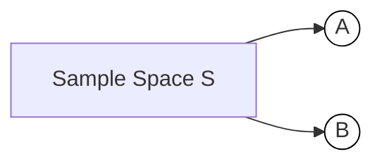

# Random Experiments, Outcomes, Sample Space, Events & Event Space

**(Beginner → Advanced) — GitHub-flavored Markdown study guide**

> Friendly, clear, and structured so anyone (even beginners) can learn and use this as repo study notes.

---

## Table of Contents

1. [Quick Summary](#quick-summary)
2. [Core Definitions](#core-definitions)
3. [Examples — simple → concrete](#examples---simple-→-concrete)
4. [Event Space & Counting formulas](#event-space--counting-formulas)
5. [Probability basics (for equally likely outcomes)](#probability-basics-for-equally-likely-outcomes)
6. [Set operations (union, intersection, complement) + visual diagrams](#set-operations-union-intersection-complement--visual-diagrams)
7. [Real-world uses / intuition](#real-world-uses--intuition)
8. [Worked examples — step by step](#worked-examples---step-by-step)
9. [Practice problems (with answers)](#practice-problems-with-answers)
10. [Advanced notes (σ-algebra, infinite sample spaces)](#advanced-notes-σ-algebra-infinite-sample-spaces)
11. [Quick cheatsheet](#quick-cheatsheet)

---

## Quick summary

* **Random experiment** — an action with uncertain result (e.g., toss a coin).
* **Outcome** — one single result of the experiment (e.g., `Heads`).
* **Sample space `S`** — set of **all** possible outcomes (e.g., `{1,2,3,4,5,6}` for a die).
* **Event `E`** — a subset of `S` (the outcomes we care about), e.g. `{2,4,6}`.
* **Event space** — the collection of all events (usually all subsets of `S` for finite cases).

---

## Core definitions

### Random experiment

* A repeatable process under the same conditions whose result cannot be predicted with certainty in advance.
* Examples: tossing a coin, drawing a card, rolling a die.

### Outcome

* A single possible result of the experiment.
* Notation: lowercase letters or elements of `S`, e.g. `3` (from a die roll).

### Sample space (`S` or `Ω`)

* The set of **all** possible outcomes.
* Example: `S = {1,2,3,4,5,6}` for a standard die.

### Event (`E`)

* Any **subset** of `S`. Can be:

  * A single outcome `{3}`
  * Multiple outcomes `{2,4,6}`
  * The whole sample space `S`
  * The empty set `∅` (an impossible event)

### Event space

* The collection (set) of all events we consider. For a finite `S` we often use the **power set** of `S` (all subsets).
* Notation: sometimes `𝓔` or `F`.

---

## Examples — simple → concrete

### Coin toss

* `S = {Head, Tail}`
* Event `E = {Head}` → "getting Head"

### Dice roll (6-sided)

* `S = {1,2,3,4,5,6}`
* Event `E_even = {2,4,6}` → "getting even number"
* Event `E_gt4 = {5,6}` → "number greater than 4"

### Card draw (one card from standard 52)

* `S = {52 cards}` (you can list them or describe by ranks+suits)
* Event `E_red = {all hearts and diamonds}` → 26 cards

---

## Event space & counting formulas

If `S` has `n` distinct outcomes (finite):

* Number of possible **events** (subsets) = **`2^n`** (the power set size).

**Example:** die `n = 6` → number of events = `2^6 = 64`.

> Why? Every element of `S` either is or isn't in a subset → 2 choices per element → `2 * 2 * ... * 2 = 2^n`.

---

## Probability basics (for equally likely outcomes)

When every outcome in `S` is equally likely:

**Definition:**

$$
P(E) = \frac{|E|}{|S|}
$$

where `|E|` = number of outcomes in event `E`, `|S|` = total outcomes.

**Example:** Rolling an even number on a fair die:

* `|E_even| = 3` (2,4,6)
* `|S| = 6`
* `P(E_even) = 3/6 = 1/2`

**Complement rule:**

$$
P(E^c) = 1 - P(E)
$$

where `E^c` = complement of `E` (outcomes in `S` not in `E`).

---

## Set operations (union, intersection, complement) + visual diagrams

### Definitions

* **Union:** `A ∪ B` = outcomes in A *or* B (or both).
* **Intersection:** `A ∩ B` = outcomes in both A *and* B.
* **Difference:** `A \ B` = outcomes in A but not in B.
* **Complement:** `A^c` = outcomes in `S` not in A.

### Probability rules

* `P(A ∪ B) = P(A) + P(B) - P(A ∩ B)`
* If `A` and `B` are **mutually exclusive** (disjoint): `P(A ∩ B) = 0`, so `P(A ∪ B) = P(A) + P(B)`.

### Venn diagram (ASCII)

```
   S = -------------------------
       ________      ________
      /        \____/        \
     /   A      \__/    B     \
    /                         \
   /___________________________\
```

* The overlapping area is `A ∩ B`.
* Non-overlap inside `S` are parts unique to `A` or `B`.

### Mermaid-like set illustration (GitHub may support Mermaid)



---

## Real-world uses / intuition

* **Medicine:** `S = {Positive, Negative}` for a test; `E = {Positive}` means the test result is positive. Used to compute sensitivity/specificity & predictive values.
* **Retail:** `S` = all products sold; `E` = purchases of a category (e.g., “dairy”). Used for market baskets.
* **Telecom / Queueing:** `S` = possible number of calls in an hour; events like `E = {≥2 calls}` are used for traffic planning.
* **Sports analytics / Betting:** Events = outcomes like win/lose/draw; probabilities used for predictions and odds.

---

## Worked examples — step by step

### Example 1 — Die (even number)

1. Identify `S = {1,2,3,4,5,6}`. `|S| = 6`.
2. Define event `E = {2,4,6}`. `|E| = 3`.
3. If fair die, outcomes equally likely →
   `P(E) = 3/6 = 1/2`.

### Example 2 — Single card is red

1. `S = 52 cards`, `|S| = 52`.
2. Event `E_red` has 26 red cards. `|E_red| = 26`.
3. `P(E_red) = 26/52 = 1/2`.

### Example 3 — Union and intersection

Experiment: roll two fair dice → `S` has `36` ordered outcomes.

* Let `A = {sum = 7}` (outcomes: (1,6),(2,5),(3,4),(4,3),(5,2),(6,1) → 6 outcomes)
* Let `B = {first die = 4}` (outcomes where first die is 4 → 6 outcomes)
* `A ∩ B` = outcomes with first die 4 and sum 7 → only (4,3) → 1 outcome
* So:

  * `P(A) = 6/36 = 1/6`
  * `P(B) = 6/36 = 1/6`
  * `P(A ∩ B) = 1/36`
  * `P(A ∪ B) = 1/6 + 1/6 - 1/36 = (6+6-1)/36 = 11/36`

---

## Quick Python snippet (compute P for equally likely finite S)

```python
# Example: probability of even number on a 6-sided die
S = [1,2,3,4,5,6]
E = [x for x in S if x % 2 == 0]
P = len(E) / len(S)
print("Event E:", E)
print("P(E) =", P)   # prints 0.5
```

---

## Practice problems (with answers)

1. **Single die:** What is `P({1 or 2})`?
   **Answer:** `|{1,2}| = 2`, `|S| = 6` → `P = 2/6 = 1/3`.

2. **Two coins:** `S = {HH, HT, TH, TT}`. What is `P(at least one Head)`?
   `E = {HH, HT, TH}` → `P = 3/4`.

3. **Card:** Draw one card. What is `P(Queen or Heart)`?

   * `P(Queen) = 4/52`
   * `P(Heart) = 13/52`
   * `P(Queen ∩ Heart)` = Queen of hearts = 1/52
   * `P(union) = 4/52 + 13/52 - 1/52 = 16/52 = 4/13`.

4. **Counting events:** For a 4-sided fair die `S = {1,2,3,4}`, how many possible events exist?
   **Answer:** `2^4 = 16`.

---

## Advanced notes

### σ-algebra (brief)

* In advanced probability (measure theory), the **event space** is not always the full power set. We use a **σ-algebra** (sigma-algebra) `𝓕` on `S` — a collection of subsets closed under countable unions, complements, etc.
* This matters when `S` is infinite (e.g., real numbers) and we need to avoid pathological sets that break measure/probability definition.

### Infinite sample spaces

* Example: toss a coin until first Head; `S` = `{1,2,3,...}` (the trial number of the first Head).
* Counting `2^n` does not apply; use measure-theoretic tools or discrete probability formulas.

---

## Visual aids (recommended in README)

* Venn diagrams for unions/intersections/complements.
* Table examples for small `S`.
* Short code snippets to enumerate events (use `itertools` in Python).

---

## Quick cheatsheet

| Symbol     | Meaning                                                    |    |                           |
| ---------- | ---------------------------------------------------------- | -- | ------------------------- |
| `S` or `Ω` | Sample space (all outcomes)                                |    |                           |
| `E`        | Event (subset of `S`)                                      |    |                           |
| \`         | S                                                          | \` | Number of outcomes in `S` |
| \`         | E                                                          | \` | Number of outcomes in `E` |
| `P(E)`     | Probability of event `E`                                   |    |                           |
| `E^c`      | Complement of `E`                                          |    |                           |
| `A ∪ B`    | Union (A or B)                                             |    |                           |
| `A ∩ B`    | Intersection (A and B)                                     |    |                           |
| `2^n`      | Number of possible events for finite `S` with `n` elements |    |                           |

---

## Want a diagram or ready-to-drop README.md?

I can:

* add **Mermaid** Venn diagrams and embed them,
* generate a `README.md` file formatted exactly for your GitHub repo,
* or create a clean printable PDF study note.

Which one should I create next? (If you want a `README.md` I’ll include Mermaid diagrams, practice problems, and the Python snippet above.)
